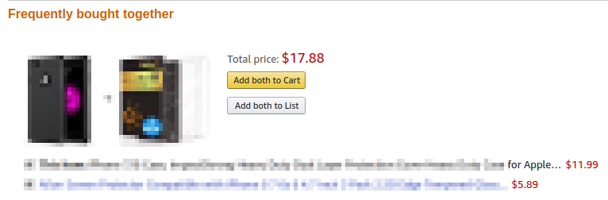
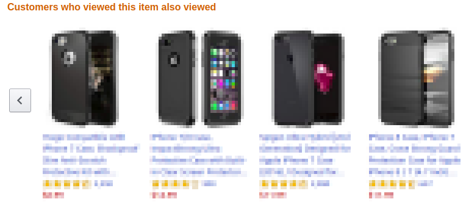
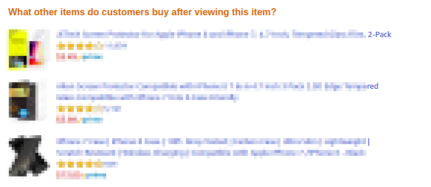

# Collaborative Filtering In MySQL

협업 필터링(collaborative filtering)은 친숙하게 사용중인 SQL 로도 가능합니다.

```sql
CREATE TABLE `tbl_order` (
    `orderserial` varchar(32) NOT NULL,
    `userid` varchar(32) NOT NULL,
    `itemid` int(11) NOT NULL,
    PRIMARY KEY (`orderserial`,`userid`,`itemid`)
) ENGINE=InnoDB DEFAULT CHARSET=utf8;
```

주문 테이블을 간소화하면 위와 같은 테이블이 됩니다.

```sql
insert into tbl_order(orderserial, userid, itemid)
values ('20190701000000001', 'A', 1), ('20190701000000001', 'A', 2), ('20190701000000001', 'A', 3);

insert into tbl_order(orderserial, userid, itemid)
values ('20190701000000002', 'B', 1), ('20190701000000002', 'B', 4);

insert into tbl_order(orderserial, userid, itemid)
values ('20190701000000003', 'C', 2), ('20190701000000003', 'C', 3), ('20190701000000003', 'C', 5);

insert into tbl_order(orderserial, userid, itemid)
values ('20190701000000004', 'D', 1), ('20190701000000004', 'D', 2), ('20190701000000004', 'D', 6);
```

샘플 데이타를 입력해 봅니다.

```sql
select A.itemid, B.itemid, count(B.itemid) as cnt
from
    tbl_order A
    join tbl_order B
    on
        1 = 1
        and A.orderserial = B.orderserial
        and A.userid = B.userid
        and A.itemid <> B.itemid
group by
    A.itemid, B.itemid
order by
    A.itemid, count(B.itemid) desc;
```

복잡한 공식없이 익숙한 SQL 만으로 `같이 구매한 상품` 데이타가 생성되었습니다.

고객 상품조회 로그를 저장하는 서버가 있는 경우, 위 쿼리는 데이타만 바꿔주면 `같이 본 상품` 데이타 생성도 가능합니다.

```sql
CREATE TABLE `tbl_weblog` (
    `yyyymmddhhmmss` varchar(32) NOT NULL,
    `userid` varchar(32) NOT NULL,
    `itemid` int(11) NOT NULL,
    PRIMARY KEY (`yyyymmddhhmmss`,`userid`,`itemid`)
) ENGINE=InnoDB DEFAULT CHARSET=utf8;
```

웹로그는 아래와 같이 정제할 수 있습니다.

```sql
insert into tbl_weblog(yyyymmddhhmmss, userid, itemid)
values ('2019-07-01 11:22:33', 'A', 1), ('2019-07-01 12:22:33', 'A', 2), ('2019-07-01 13:22:33', 'A', 3);

insert into tbl_weblog(yyyymmddhhmmss, userid, itemid)
values ('2019-07-01 11:40:33', 'B', 1), ('2019-07-01 11:41:33', 'B', 4);

insert into tbl_weblog(yyyymmddhhmmss, userid, itemid)
values ('2019-07-01 09:22:33', 'C', 2), ('2019-07-01 09:55:33', 'C', 3), ('2019-07-01 09:59:33', 'C', 5);

insert into tbl_weblog(yyyymmddhhmmss, userid, itemid)
values ('2019-07-01 15:22:33', 'D', 1), ('2019-07-01 16:22:33', 'D', 2), ('2019-07-01 17:22:33', 'D', 6);
```

같은 날짜에 본 상품을 같이 본 상품으로 정하면 동일한 쿼리를 적용할 수 있습니다.

```sql
select A.itemid, B.itemid, count(B.itemid) as cnt
from
    tbl_weblog A
    join tbl_weblog B
    on
        1 = 1
        and left(A.yyyymmddhhmmss, 10) = left(B.yyyymmddhhmmss, 10)
        and A.userid = B.userid
        and A.itemid <> B.itemid
group by
    A.itemid, B.itemid
order by
    A.itemid, count(B.itemid) desc;
```

여기까지는 협업 필터링을 SQL 로 구현한 것에 불과하고 실제로 서비스에는 사용할 수 없는 데이타입니다.

`같이 구매한 상품` 을 예로 들어봅니다. 우리가 원하는 같이 구매한 상품은 "노트북을 살 때 마우스도 같이 살 것이다" 라는 생각이지만 현실은 베스트셀러가 같이 구매한 상품이 되는 경우가 더 많습니다.

간단한 예로 엑셀 도서를 구매하려는 고객이 있습니다. 그런데 메인 페이지에 삼겹살이 특가로 세일을 하여 그것을 본 고객은 엑셀도서와 삼겹살을 같이 구매하게 되는거죠.

위 문제를 해결하는 가장 간단한 방법은 카테고리 제한이었습니다.

```sql
CREATE TABLE `tbl_order_v2` (
    `orderserial` varchar(32) NOT NULL,
    `userid` varchar(32) NOT NULL,
    `category` varchar(32) NOT NULL,
    `itemid` int(11) NOT NULL,
  PRIMARY KEY (`orderserial`,`userid`,`itemid`)
) ENGINE=InnoDB DEFAULT CHARSET=utf8;

insert into tbl_order_v2(orderserial, userid, category, itemid)
values ('20190701000000001', 'A', 'book', 1), ('20190701000000001', 'A', 'book', 2), ('20190701000000001', 'A', 'food', 3);

insert into tbl_order_v2(orderserial, userid, category, itemid)
values ('20190701000000002', 'B', 'book', 1), ('20190701000000002', 'B', 'food', 4);

insert into tbl_order_v2(orderserial, userid, category, itemid)
values ('20190701000000003', 'C', 'book', 2), ('20190701000000003', 'C', 'food', 3), ('20190701000000003', 'C', 'food', 5);

insert into tbl_order_v2(orderserial, userid, category, itemid)
values ('20190701000000004', 'D', 'book', 1), ('20190701000000004', 'D', 'book', 2), ('20190701000000004', 'D', 'food', 6);

select A.itemid, B.itemid, count(B.itemid) as cnt
from
    tbl_order_v2 A
    join tbl_order_v2 B
    on
        1 = 1
        and A.orderserial = B.orderserial
        and A.userid = B.userid
        and A.category = B.category
        and A.itemid <> B.itemid
group by
    A.itemid, B.itemid
order by
    A.itemid, count(B.itemid) desc;
```

협업 필터링은 몇가지 내재된 단점이 존재합니다.

우선, 콜드 스타트(Cold Start) 입니다.
같이 구매한 상품 데이타를 구하려 할 때 오늘 등록된 신상품은 추천할 데이타가 없습니다.
이 문제를 해결하기 위해 실시간 또는 시간단위 업데이트를 통해 추천 데이타가 없는 시간을 단축시키는 방법이 동원됩니다.

또, 롱테일(Long tail) 문제입니다.
많은 종류의 상품이 있다고 할 때 고객들은 일부 상품에 집중하는 경향이 있습니다.
이러한 상품들 중 가장 많이 팔린 상품이 베스트셀러가 되는거죠.
문제는 40% 이상의 상품이 구매에서 배제되고 당연히 `같이 구매한 상품` 에도 제외됩니다.

협업 필터링은 매우 간단하지만 또 매우 강력한 추천시스템입니다.

위에서는 상품정보 중 카테고리 정보만 추가하여 필터링을 고도화하였는데, 상품정보에는 많은 정보가 있습니다.
브랜드, 가격대, 색상 등 여러 정보를 추가하면 넷플릭스 같은 고도화된 추천시스템을 구현할 수 있을겁니다.

~~"추천시스템? 나는 그런거 몰라" 이러고 있으실 개발자를 위해.~~

위 협업필터링이 아마존에 적용된 사례입니다.
(상품정보는 저작권에 휘말릴까 해서 모자이크 처리했습니다.)

상품중에 높은 빈도로 같이 구매가 이루어지는 상품이 있습니다.



같이 본 상품 데이타입니다.



고객 상품 조회로그와 상품 구매내역을 조인하면 아래 데이타가 생성됩니다.


